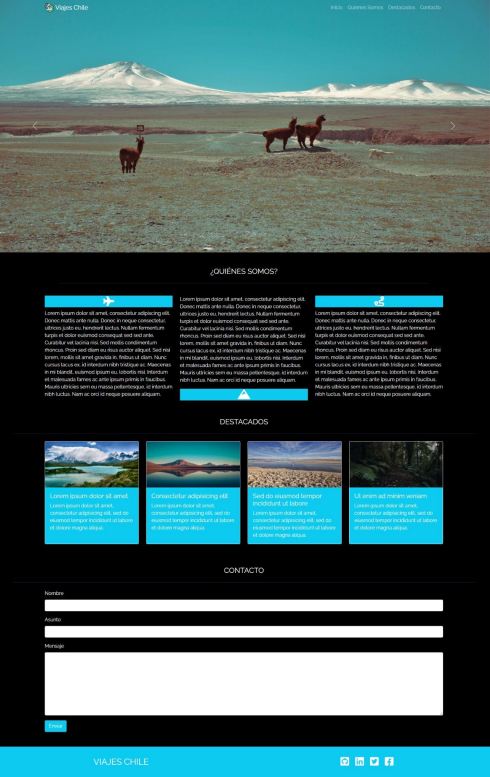

<h1 align="center"> Viajes Chile </h1>

   
   :construction: Proyecto en construcción :construction:

### Temas 

- [Descripción del Desafio: de Desafio Latam](#descripción-del-desafio:-de-desafio-latam)

- [Funcionalidades](#funcionalidades)

- [diseño](#diseño)

- [Herramientas utilizadas](#herramientas-utilizadas)

- [Acesso al proyecto](#acesso-al-proyecto)

- [Abrir y rodar el proyecto](#abrir-y-rodar-el-proyecto)

## Descripción del Desafio: de Desafio Latam

  ¡Agencia de Viajes Chile!

El desafio, "Viajes Chile" donde se solicitad la creación de una Landing Page, con un diseño atractivo donde se integra todo lo que se ha visto en el segundo modulo, del Bootcamp full Stack JavaScript de la academia Desafio Latam.

## Funcionalidades

:heavy_check_mark: `Funcionalidad 1:` 

:heavy_check_mark: `Funcionalidad 2:` 

## Diseño

###

## Herramientas utilizadas

<svg xmlns="http://www.w3.org/2000/svg" width="100px" viewBox="0 0 576 512"><!--!Font Awesome Free 6.5.1 by @fontawesome - https://fontawesome.com License - https://fontawesome.com/license/free Copyright 2024 Fonticons, Inc.--><path d="M333.5 201.4c0-22.1-15.6-34.3-43-34.3h-50.4v71.2h42.5C315.4 238.2 333.5 225 333.5 201.4zM517 188.6c-9.5-30.9-10.9-68.8-9.8-98.1c1.1-30.5-22.7-58.5-54.7-58.5H123.7c-32.1 0-55.8 28.1-54.7 58.5c1 29.3-.3 67.2-9.8 98.1c-9.6 31-25.7 50.6-52.2 53.1v28.5c26.4 2.5 42.6 22.1 52.2 53.1c9.5 30.9 10.9 68.8 9.8 98.1c-1.1 30.5 22.7 58.5 54.7 58.5h328.7c32.1 0 55.8-28.1 54.7-58.5c-1-29.3 .3-67.2 9.8-98.1c9.6-31 25.7-50.6 52.1-53.1v-28.5C542.7 239.2 526.5 219.6 517 188.6zM300.2 375.1h-97.9V136.8h97.4c43.3 0 71.7 23.4 71.7 59.4c0 25.3-19.1 47.9-43.5 51.8v1.3c33.2 3.6 55.5 26.6 55.5 58.3C383.4 349.7 352.1 375.1 300.2 375.1zM290.2 266.4h-50.1v78.4h52.3c34.2 0 52.3-13.7 52.3-39.5C344.7 279.6 326.1 266.4 290.2 266.4z"/></svg> Bootstrap

<svg xmlns="http://www.w3.org/2000/svg" width="100px" viewBox="0 0 448 512"><!--!Font Awesome Free 6.5.1 by @fontawesome - https://fontawesome.com License - https://fontawesome.com/license/free Copyright 2024 Fonticons, Inc.--><path d="M356.9 64.3H280l-56 88.6-48-88.6H0L224 448 448 64.3h-91.1zm-301.2 32h53.8L224 294.5 338.4 96.3h53.8L224 384.5 55.7 96.3z"/></svg>Vuejs

###
## Acesso al proyecto

Puedes [acceder al código fuente del proyecto](https://github.com/AngeloGP15/Desafio_Viajes_Chile).

## Abrir y rodar el proyecto

- 
- 🏆 
